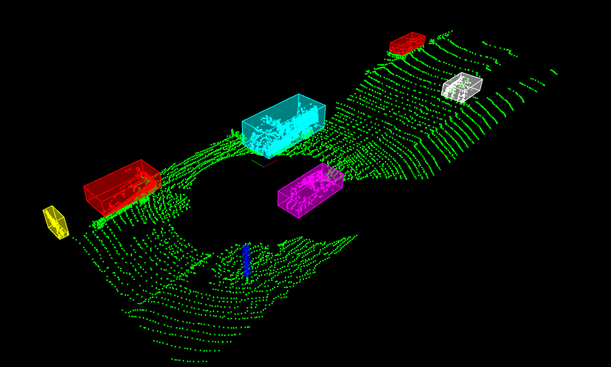

# Sensor Fusion Self-Driving Car Course - COMPLETED PROJECT

Sensor Fusion Lidar obstacle detection project

Two complete this project several tasks needed to be completed.
- Voxel filtering of the Lidar point cloud.
- Segementation of the road from the rest of Lidar point cloud. A RANSAC algorithm has been implemented to do this job.
- Clustering of the Lidar point clouds so that objects can be identified and bounding boxes can be placed around each obstacle (car, tree, traffic signs, etc)
Clustering is done by implemeting kNN using kd-Tree structures.

The codes in processPointClouds.cpp, ProcessPointClouds.h, ransac3D.h, kdtree3D.h have been completed in this project. The envoronment.cpp has several visualization features that can be modified for a different experience if desired.

At each Frame:
- Read the point cloud
- Downsample the cloud by Voxel filtering
- Segmentation: Separate road point cloud from the rest of cloud points. Left with road and obstacles clouds. (RANSAC used)
- Cluster the obstacle cloud. Each object to be assigned to a cluster and a bonding box that shows its range of points. (Binary search and KdTree is used)

---

The base and data from Udacity at: https://github.com/udacity/SFND_Lidar_Obstacle_Detection

Instructions to install on windows:

0. Install cvpkg
1. Istall PCL: e.g. https://pointclouds.org/downloads/
2. Clone this github repo
3. Use the same CMake list here
4. Install Visual Studio 
5. Follo these in shell:
   cd ~/SFND_Lidar_Obstacle_Detection
   mkdir build ... and then cd build
   cmake ..
6. Now project file is open and ready to open in Visual Studio

I had to fix several issues along the way, you can contact me if there was a problem.

### Code for binary search using 3D Kd-Tree structure for nearest neighbours search has been implemented

### Code for RANSAC has been implemented

The procedure is as follows:

